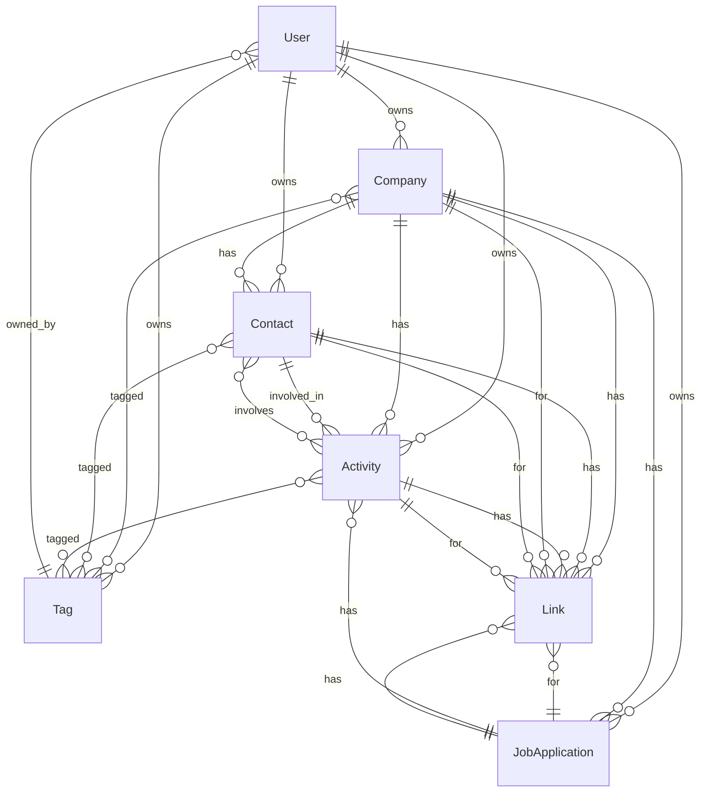

# Career Craft Data Model

This document describes the database schema for the Career Craft application, as defined in `prisma/schema.prisma`. It includes details about all tables (models), their fields, and relationships, as well as a visual Mermaid diagram of the schema.

---

## Data Model Overview

### User
- **id**: String (ULID, PK)
- **email**: String (unique)
- **password**: String
- **firstName**: String
- **lastName**: String
- **createdAt**: DateTime
- **updatedAt**: DateTime
- **Relations**:
  - `activities`: [Activity] (1:N)
  - `companies`: [Company] (1:N)
  - `contacts`: [Contact] (1:N)
  - `jobApplications`: [JobApplication] (1:N)
  - `tags`: [Tag] (1:N)

### Company
- **id**: String (ULID, PK)
- **name**: String
- **industry**: String?
- **description**: String?
- **location**: String?
- **size**: String?
- **logo**: String?
- **notes**: String?
- **createdAt**: DateTime
- **updatedAt**: DateTime
- **userId**: String (FK → User)
- **Relations**:
  - `user`: User (M:1)
  - `activities`: [Activity] (1:N)
  - `contacts`: [Contact] (1:N)
  - `jobApplications`: [JobApplication] (1:N)
  - `tags`: [Tag] (M:N, implicit)
  - `links`: [Link] (1:N)

### Contact
- **id**: String (ULID, PK)
- **firstName**: String
- **lastName**: String
- **email**: String?
- **phone**: String?
- **position**: String?
- **department**: String?
- **image**: String?
- **summary**: String?
- **notes**: String?
- **lastContactDate**: DateTime?
- **createdAt**: DateTime
- **updatedAt**: DateTime
- **userId**: String (FK → User)
- **companyId**: String? (FK → Company)
- **Relations**:
  - `user`: User (M:1)
  - `company`: Company? (M:1, optional)
  - `activities`: [Activity] (1:N)
  - `tags`: [Tag] (M:N, implicit)
  - `links`: [Link] (1:N)

### JobApplication
- **id**: String (ULID, PK)
- **position**: String
- **status**: String
- **priority**: String (default: "medium")
- **jobDescription**: String?
- **salary**: String?
- **notes**: String?
- **source**: String?
- **createdAt**: DateTime
- **updatedAt**: DateTime
- **userId**: String (FK → User)
- **companyId**: String (FK → Company)
- **Relations**:
  - `user`: User (M:1)
  - `company`: Company (M:1)
  - `activities`: [Activity] (1:N)
  - `links`: [Link] (1:N)

### Activity
- **id**: String (ULID, PK)
- **type**: String
- **title**: String?
- **subject**: String
- **description**: String?
- **date**: DateTime
- **duration**: Int?
- **note**: String?
- **followUpDate**: DateTime?
- **createdAt**: DateTime
- **updatedAt**: DateTime
- **userId**: String (FK → User)
- **companyId**: String? (FK → Company)
- **jobApplicationId**: String? (FK → JobApplication)
- **Relations**:
  - `user`: User (M:1)
  - `company`: Company? (M:1, optional)
  - `jobApplication`: JobApplication? (M:1, optional)
  - `contacts`: [Contact] (M:N, implicit)
  - `tags`: [Tag] (M:N, implicit)
  - `links`: [Link] (1:N)

### Tag
- **id**: String (ULID, PK)
- **name**: String (unique)
- **color**: String?
- **description**: String?
- **createdAt**: DateTime
- **updatedAt**: DateTime
- **userId**: String (FK → User)
- **Relations**:
  - `user`: User (M:1)
  - `contacts`: [Contact] (M:N, implicit)
  - `company`: [Company] (M:N, implicit)
  - `activity`: [Activity] (M:N, implicit)

### Link
- **id**: String (ULID, PK)
- **url**: String
- **label**: String?
- **companyId**: String? (FK → Company)
- **contactId**: String? (FK → Contact)
- **jobApplicationId**: String? (FK → JobApplication)
- **activityId**: String? (FK → Activity)
- **createdAt**: DateTime
- **updatedAt**: DateTime
- **Relations**:
  - `company`: Company? (M:1, optional)
  - `contact`: Contact? (M:1, optional)
  - `jobApplication`: JobApplication? (M:1, optional)
  - `activity`: Activity? (M:1, optional)

---

## Relationships

- **User** is the owner of all data (cascade delete on user removal).
- **Company**, **Contact**, **JobApplication**, **Activity**, **Tag**, and **Link** are all associated with a User.
- **Company** can have many Contacts, Activities, JobApplications, Tags, and Links.
- **Contact** can belong to a Company (optional), and can have many Activities, Tags, and Links.
- **JobApplication** belongs to a Company and User, and can have many Activities and Links.
- **Activity** can be linked to Company, JobApplication, multiple Contacts, Tags, and Links.
- **Tag** can be applied to Contacts, Companies, and Activities (many-to-many, implicit via Prisma).
- **Link** can be associated with Company, Contact, JobApplication, or Activity (all optional, one per link).

### Many-to-Many Relationships
- **Prisma implicit many-to-many relations** are preferred for flexibility and simplicity. These are defined by having a list field on both related models (e.g., `Contact.tags` and `Tag.contacts`).

---

## Mermaid ER Diagram

---

## Notes
- All primary keys are ULIDs (String).
- Cascade deletes are enforced for user-owned data.
- All many-to-many relationships use Prisma's implicit join tables for simplicity and maintainability.
- See `prisma/schema.prisma` for the authoritative schema.
